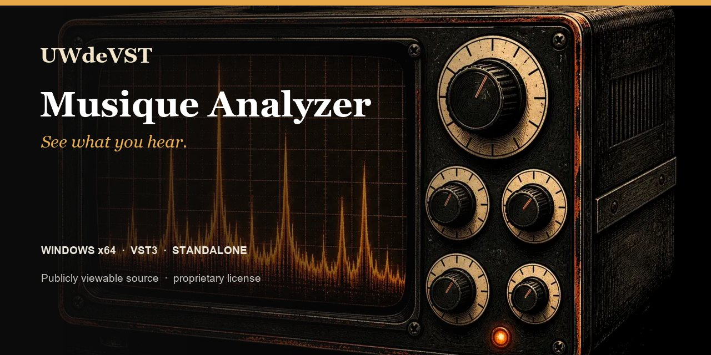

<!-- UWDEVST-SHOWCASE:START -->

  

<h1 align="center">Musique Analyzer</h1>

<strong>See what you hear.</strong> Spectrum, loudness and stereo image: a visual companion for informed mix decisions.

  <a href="https://unicorsoundengine.com/en/plugins/fx-analyzer#listen">Listen</a> ·
  <a href="https://unicorsoundengine.com/en/plugins/fx-analyzer#install">Download</a> ·
  <a href="https://unicorsoundengine.com/en">Full collection</a> ·
  <a href="https://github.com/unicornwhodev/fx-analyzer/issues/new/choose">Report an issue</a>

**Windows x64 · VST3 · Standalone**

- Spectrum and spectrogram
- Oscilloscope and loudness
- Stereo field view

> **Publicly viewable source — proprietary license.** Official binaries are free for individuals and organizations with no more than EUR 100,000 in worldwide consolidated gross revenue. Modification and redistribution are not permitted. Professional use above that threshold requires a paid written license. [Read the license](https://unicorsoundengine.com/en/license) or [request a commercial license](https://unicorsoundengine.com/en/contact).

The license included with each tagged release governs that release. The v1.0 license applies prospectively and does not withdraw permissions already granted on earlier releases.
<!-- UWDEVST-SHOWCASE:END -->

---

# Musique Analyzer

Musique Analyzer is a Windows audio-analysis companion for mixing, sound design and final checks. It provides spectrum, spectrogram, oscilloscope, loudness and stereo-field views in a Standalone application or VST3 plug-in.

## Formats

- Windows x64 Standalone
- Windows x64 VST3

## Install a release

1. Download the Windows installer or portable ZIP from this repository's Releases page.
2. Run the installer, or extract the ZIP and copy the complete .vst3 bundle to a VST3 location scanned by your host.
3. Rescan plug-ins in the host, then insert the effect on the track or bus you want to process.

## What you can monitor

- Spectrum and spectrogram detail for tonal balance and transient content.
- Oscilloscope timing, trigger and persistence controls.
- Loudness history, hold and gate controls for session-level monitoring.
- Stereo field, balance, correlation and decay controls for width checks.
- Input and output monitoring workflows, selected through the factory presets.

Use Hold or Freeze when you need to compare a moment in the signal with live audio. Display settings affect the analysis view; they do not replace your host's gain staging or export checks.

## Factory presets

The included bank contains 14 starting points: input and output monitoring, spectrum and sweep focus, spectrogram, oscilloscope, loudness and stereo/correlation views. Select a preset first, then adjust the analysis range, smoothing, visual resolution and the controls specific to the active view.

## Build from source

Requirements: Windows x64, PowerShell, Git, CMake 3.22 or later, Visual Studio 2022 (or Build Tools) with Desktop development with C++, and JUCE 8.0.4.

~~~powershell
.\_build_all.ps1 -Configuration Release -BootstrapJuce
~~~

To use an existing JUCE 8.0.4 checkout:

~~~powershell
.\_build_all.ps1 -Configuration Release -JuceDir C:\Dev\JUCE
~~~

The build produces Standalone and VST3 artefacts.

## Package a local build

~~~powershell
.\_package_release.ps1 -Configuration Release -BootstrapJuce
~~~

The script creates a portable Windows package and, when Inno Setup 6 is installed, a Windows installer. Use the SkipInstaller option when an installer is not required.

## Repository contents

| Path | Purpose |
| --- | --- |
| Source/ | Plug-in source, effect engines and visual assets |
| Presets/ | Factory preset bank |
| FXShared/ | Local shared UI and audio helpers required by this plug-in |
| installer/ | Windows installer definition |

## Licence and support

The source code is publicly viewable under a proprietary license. Viewing and private compilation of strictly unchanged source are permitted; modification and redistribution are not. See [LICENSE.md](LICENSE.md). For a released-build issue, open an issue with the Windows version, host name/version, plug-in format and steps to reproduce it.
